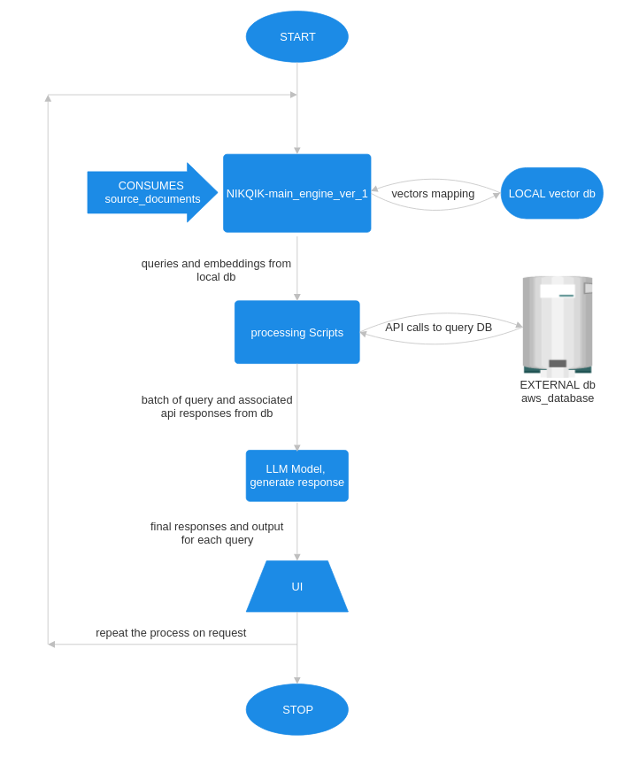

# flowchart nikqik_chatengine_ver1

# tree  version_1
    ├── constants.py
    
    ├── documentation.md
    
    ├── ingest.py
    
    ├── Makefile
    
    ├── privateGPT.py
    
    ├── README.md
    
    ├── requirements.txt
    
    └── uploader.py

# Integrated working of Backend Chatengine

All these files work together to form a system designed for Question/Answering on private documents leveraging the power of Transformers language models. Here's how they interconnect:

1. The ingest.py script is responsible for the ingestion process of various types of documents using customized loaders. The ingested documents are then processed, and their vector embeddings are stored using a Chroma vector store.
2. The privateGPT.py script uses these vector embeddings to respond to user queries. It creates a RetrievalQA instance, which is a combination of a retriever (to fetch relevant document chunks) and a LLMs model (for generating responses to queries).
3. The uploader.py script is a flask server that handles file uploads. For a successfully uploaded file, it triggers ingest.py and then privateGPT.py.
4. The Makefile provides an easy way to execute commonly used commands like setting up the project, running the local server, and starting the uploader or processing scripts.
    Remember, the ingest.py and privateGPT.py scripts are independent of the flask server. They can be triggered manually without an upload process. 

# script wise description

1. **constants.py**

    It utilizes Python's as module to interact with operating system conditions, more specifically, environment variables in the definition of PERSIST_DIRECTORY.
    PERSIST_DIRECTORY is assigned the environment variable PERSIST_DIRECTORY, if it exists, otherwise it is assigned the string value 'db'. This is utilized as the path where the database will be stored.
    CHROMA_SETTINGS is a settings object from the chromed!). conf ig module. It uses the previously mentioned PERSIST_DIRECTORY as the persist_directary attribute, and also sets the attribute ananymized_telemetry to False, which implies that telemetry data will not be altered for the purpose of privacy.
    Please continue your review of other files. I will pull the content for 'ingest.py. next. Is this understanding fine so far? 

2. **ingest.py**

    This file is an elaborate one dedicated to the ingestion process of different types of documents through customized loaders. It's outlined into four main parts - setting the environment, creating customized loaders, defining the document processing functions, and finally, the main function. 

    **A.** The environment variables persist directory, source_directory, embeddings_model_neme, chunk_size, chunk_overlap are loaded with default values if they aren't given. 
    
    **B.** Custom document loaders are defined to cater to different kinds of documents like ..csv", ".docx., ..html", etc. There': also a MyElmLoader defined to deal with elm extensions. All these loaders are arranged under LOADER_ MAPPING. 
    
    **C.** Several functions are defined to ingest documents: - loadsingledocument: Used to bad a single document based on its file extension. - load_ documents: Iterates over all the files within the source_ directory and uses multi-threading to load them. - process_documents: First, A bads the documents using loadclocuments function then proceed by splitting loaded documents into chunks. It prints useful information for the user to keep track of the process. - does_vectorstoreexist: Checks whether the vectorstore exists or not in the given persist_directory. 
        
    **D.** The main function is defined which creates embeddings and checks if vectorstore exists in the persist_directory. According to that, it either updates the existing vectorstore or creates a new one. At last, it prints a message signaling that the ingestion is complete. 

3. **privateGPT.py**

    The script first imports the necessary modules and sets up several environment variables which includes the details of the GPT model, the embeddings model, the path to the persistent directory, and the number of source chunks targeted. - The main function creates a new instance of HuggingFaceEmbeddings using the model defined by embeddings_rnodel_narne. It also creates a new instance of Chroma Vector-Store which is dedicated to store vector embeddings of the chunks of text from documents. - The method as retriever defines a retriever object with defined number of chunks (k) as target data. - An instance of 011ama language model is created with defined callbacks. - RetrievalQA (which represents a combination of a retriever and a language model) is initialized with the LLAMA language model instance, retriever and the specified chain type. - The script then enters an infinite loop to accept user queries and responds with an answer. The answer is retrieved using the qa 0 method. It also displays the time taken to generate the answer and the relevant source documents from where the answers were drawn If not hidden through command-line arguments). - The function parse _arguments is used to handle command-line arguments to customize the output based on user preferences. 

4. **uploader.py**

    - The script first sets up a flask app and configures the upload folder and the allowed file extensions.
    - An upload endpoint within the Flask application is created that takes 'POST' requests. This endpoint is set up to handle
    file uploads: files sent as multipart form data are saved in the source_documents directory.
    - After a successful file upload, the script will call the ingest.py script and waits for it to finish. It then proceeds to call the privateGPT.py script.
    - The server is set to run on the port 5001.
    Now, we can analyze how all these files work together in the next part. Is that fine with you?

